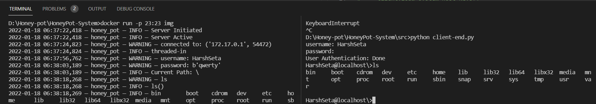
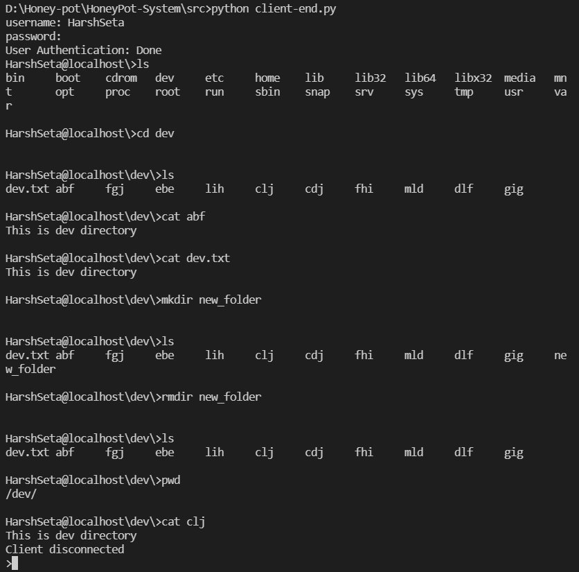
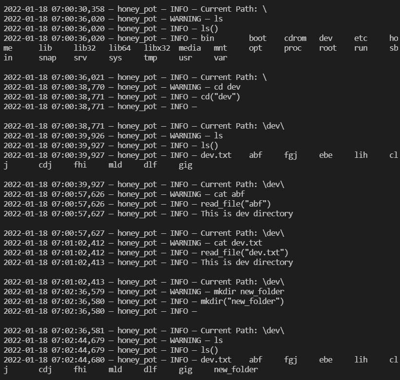

# Honeypot
A Python Implementation of a basic honey pot, that detects the presence of any attacks that the attacker might be trying on your system. Contains a debian fake file system to trap the attacker in the honey pot for as long as possible, while maintaining a proper log records for future analysis.

## To initiate the whole project and for repetitive builds
``` docker build -t img . ```

## To run the program
``` docker run -p 23:23 img ```

## Run the client-end file from other terminal
``` python client-end.py ```

## Log file location
``` /var/lib/docker/containers/<container id>/<container id>-json.log ```

## Demonstration 

### Server (left) and Client(right) ends of the network


Intrusion activities of the attacker.        |  How the activity of the attacker will be logged.
:-------------------------:|:-------------------------:
  |  

The intruder gets disconnected from the server after 5 minutes of his log-in activity.


